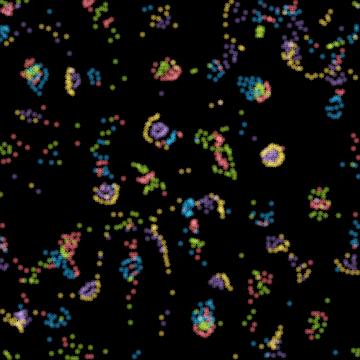

# Particle Life

An artificial-life sandbox where lifelike behavior emerges from almost nothing.

**▶ Live, full-screen, in your browser: https://leochilds.github.io/particle-life/**



The live page runs a universe continuously, shows a real-time **vitality** meter,
and notices when a universe has gone quiet so it can quick-search for a fresh
lively one (with optional auto-replace). **Drag the canvas to stir it** — tear a
structure apart and watch it heal — right-drag (or shift-drag) to repel. Any
universe you love is shareable via its URL.

Scatter a few thousand particles of a handful of colors. Give every ordered pair
of colors a single number — how much one is attracted to (or repelled by) the
other. Let short-range forces play out on a wraparound world. That's the entire
model. No genomes, no neural networks, no fitness function, no goal.

And yet what emerges looks alive: cells with membranes, chasing predators and
fleeing prey, wandering organisms, structures that heal themselves when you tear
them apart. The complexity isn't programmed anywhere — it lives in the
*interactions*. This repo is a clean, fast, well-tested implementation, plus a
search that hunts down the rare universes where interesting things happen.

## The idea in one matrix

Everything about a universe is captured by its interaction matrix `A`, where
`A[i, j]` is the force species *i* feels toward species *j*:

```
        red   yellow  green   blue   purple
red   [-0.04  -0.25   0.97    0.44   0.90 ]
yellow[-0.76   0.70   0.27   -0.76   0.18 ]
green [ 0.37  -0.98  -0.09    0.65  -0.41 ]
blue  [-0.08  -0.12  -0.40    0.84   0.56 ]
purple[-0.78   0.99   0.76   -0.43   0.67 ]
```

Positive pulls together, negative pushes apart. Crucially the matrix is
**asymmetric**: red chases green (`+0.97`) while green is fairly indifferent to
red (`+0.37`). That imbalance is the engine of all the motion — symmetric rules
just settle into static blobs.

Forces are short-range and follow the classic piecewise curve: a hard repulsive
core at very close range (particles can't overlap) and a triangular
attraction/repulsion band further out that fades to zero at the interaction
radius.

## Why most universes are boring

Pick a matrix at random and you almost always get one of two duds: a uniform gas
that never clumps, or a dead collapse where everything freezes into one ball. The
interesting universes are rare and sit in between — structured *and* restless.

`discover` mode quantifies that with an "interestingness" score combining three
measurements taken after the world settles:

- **clustering** — particles are unevenly distributed (structure exists)
- **motion** — the system keeps moving (it isn't frozen)
- **heterogeneity** — the structure keeps *changing* (it isn't a static crystal)

It samples many random matrices and surfaces the best ones, so you spend your
time watching life instead of soup.

## Install

Needs Python 3.10+. Everything else — including the `ffmpeg` used for encoding —
is installed into a local virtual environment, so the project doesn't depend on
what happens to be on the host.

```bash
./setup.sh                 # creates .venv and installs the package + ffmpeg
source .venv/bin/activate  # then `particle-life ...` is on your PATH
```

<details>
<summary>Manual setup (equivalent)</summary>

```bash
python3 -m venv .venv
source .venv/bin/activate
pip install -e ".[dev]"    # or: pip install -r requirements.txt
```
</details>

ffmpeg comes from the `imageio-ffmpeg` wheel as a bundled binary, so no system
install is required. If you already have ffmpeg on your PATH, that one is used.

## Usage

Once the environment is active you can use the `particle-life` command (or
`python -m particle_life`, which is identical):

```bash
# Hunt for an interesting universe; saves the winning matrix to best.npy
particle-life discover --species 5 --trials 30 --out best.npy

# Render a saved universe to an MP4 (or .gif by extension)
particle-life render --matrix best.npy --seconds 12 --out life.mp4

# Search and render the winner in one shot
particle-life render --discover --trials 30 --seconds 12 --out life.mp4
```

Not into activating environments? Call the binary directly:
`.venv/bin/particle-life render --discover --seconds 12 --out life.mp4`

Useful knobs: `--particles`, `--species`, `--width`, `--glow`, `--fps`,
`--substeps` (sim steps per rendered frame — raise it to speed up apparent
motion), `--settle` (warmup steps before recording).

### As a library

```python
from particle_life.core import Config, Simulation
from particle_life.render import render

sim = Simulation(Config(n_particles=1500, n_species=5, seed=7))
sim.run(400)
render(sim.pos, sim.species, sim.cfg.size, width=800).save("frame.png")
```

## How it's built

```
particle_life/
  core/
    engine.py      vectorized numpy simulation; torus world; spatial-hash
                   neighbor search (~O(N), not O(N^2)); piecewise force curve
    discovery.py   interestingness scoring + random-matrix search
  render/
    image.py       additive soft-glow splatting with a tone-mapped palette
    video.py       streams raw frames straight into ffmpeg (no temp files)
  cli.py           the `discover` / `render` commands
tests/             invariants + a brute-force check that the grid search is exact
```

The simulation is a torus, so there are no walls for particles to pile against.
Neighbors are found with a uniform grid bucketed by cell; a test checks the grid
search returns *exactly* the same pairs as an O(N²) brute-force reference.

## Live web viewer

The `docs/` folder is a dependency-free, static page (served via GitHub Pages)
that runs the whole thing client-side:

- **`docs/sim.js`** — the engine ported to JavaScript (linked-list spatial-hash
  grid, typed arrays), matching the Python force curve and integration so the
  look carries over. Runs ~2k particles at 60fps.
- **`docs/app.js`** — Canvas rendering with additive glow sprites, the live
  vitality meter, boredom detection, the best-of-N universe quick-search,
  pointer "stir" interaction, an About panel, and URL-hash sharing.

It's plain ES modules with no build step, so opening `docs/index.html` from any
static server just works (`npm run serve` does exactly that). Keys: `space`
pause, `n` new universe, `h` hide UI. The JS engine has its own test suite:

```bash
npm test    # node --test over tests/*.test.mjs
```

## Background

Particle Life descends from Jeffrey Ventrella's *Clusters* and was popularized by
Tom Mohr, CodeParade, and others. It's a member of the same family as Lenia and
classic cellular automata: simple local rules, startlingly global behavior. If
you find a universe you love, save its `.npy` matrix — that one file *is* the
organism.

## License

MIT. Built as an open-ended exploration of emergence — have fun with it.
